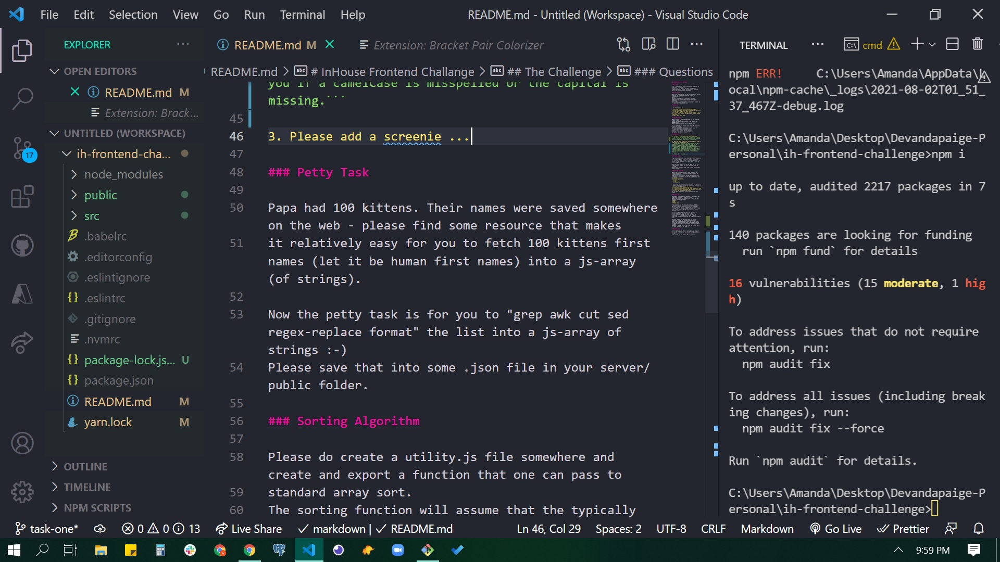

# InHouse Frontend Challange

### Welcome

Hey, I'm Joehannes, your Frontend lead. I'd like to say hello: "Hi there :-)"
Since we're all remmote and part time I really appreciate a self starter and pro active attitude.
Also, let your choices be reasonable :-)

### Time limit

None, but we would like you to consider wisely on your own how you handle the situation on your own initiative :-)
Hint:
Usually we appreciate a reasonable choice of dedication to detail and a getting-things done attitude.
Also, there actually might be a reasonable timeout so to speak after a weeks period.

### Outline

The task consists of

✅ a getting to know each other question-tuple

- a how do you make your way around a petty repetitive task you just have to get done thingy
- a sorting algorithm (really, this is so easy - it is more of a check on your diligence than on your coding abilities)
- and a small React task

## The Challenge

Please create a public github repo for the task and share it with us.
Answer the following questions right here in the README please.
Please add a screenshot of your IDE as well ...

So, in order to get to know each other: My favourite editor is neovim.
I first switched to it because I kinda liked the terminal and those heavyweight GUIs
wouldn't work well on my slow machine.
Somehow I got into it and stuck with it.
I can now say: (n)vim rocks!!!

### Questions

1. So, what's your (favourite) editor/IDE story?
   `My current IDE is Visual Code Studio - It's really where I started and am the most comfortable, although I'm pretty quick to find comfort in new things.`

2. While at that, what's your favourite plugin with it and what's so superb about it?
   `Bracket Pair Colorizer is really useful for me in making sure I'm working within the right set of brackets. It works really well with JSONs too especially when paired with the JSON-Template plugin`
   `Prettier and ESLint help me keep to a clean codebase, while Code Spell Checker helps me a LOT in keeping up with spelling errors, and will even alert you if a camelCase is misspelled or the capital is missing.`

3. Please add a screenie ...
   
   `Personally I like the Andromeda Dark Italics theme`

### Petty Task

Papa had 100 kittens. Their names were saved somewhere on the web - please find some resource that makes
it relatively easy for you to fetch 100 kittens first names (let it be human first names) into a js-array (of strings).

`Created FetchNames.txt to hold fetch requests from http://names.drycodes.com/. Then pulled both 50 boy names and 50 girl names into one array of strings within the catNames.json in the public folder.`

Now the petty task is for you to "grep awk cut sed regex-replace format" the list into a js-array of strings :-)

`😅`

Please save that into some .json file in your server/public folder.

### Sorting Algorithm

Please do create a utility.js file somewhere and create and export a function that one can pass to
standard array sort.
The sorting function will assume that the typically passed in parameters "a, b" to the sort function are:

- objects
- with the properties:
  - name
  - age
  - ninjaLevel

You see, we all love clear instructions. But real life happens, and I want to see you navigate on your own :-)
So, I just let you know:

- ninjas are really important to Papa
- he loves his kittens a lot and knows them all by name
- he doesn't really care about age, but just as a side note, all the cats are 5 and younger
  By the way: He slightly prefers ninja-skills over names.

### React app

Somewhere in the prepared skeleton I left a hint for the table component I want you to use.
Please go find it and simply build a table for the kittens that has 3 columns:

- Name
- Age
- Ninja Level

The component you are using has a decent README on github, so please help yourself on how to use it.
By the way, you'll find a passage in that README talking about a custom sorting function, and I'd like
you to use the sorting algorithm you wrote in the previous task.

Also, when you found the table you took note of styled-components being in there, right?
Please use that package to style the table to something ... (not important as long as I see
you using styled component and CSS in a useful/orderly way)

Finally, I want you to create your own overlay component (styled via styled-components again).
When you click any kittens name, the overlay opens, blurs the background and shows in the middle/center
a random cat image (did I mention lorempixel can do that??).
Somehow I want to be able to close the overlay again as well, but that's it, ok?? :-)

### Easter Egg

I love dotfiles. So there's a few dotfiles here as well, and if I run that one non-default package.json script
I'd love to see you respect my dotfiles :-)
